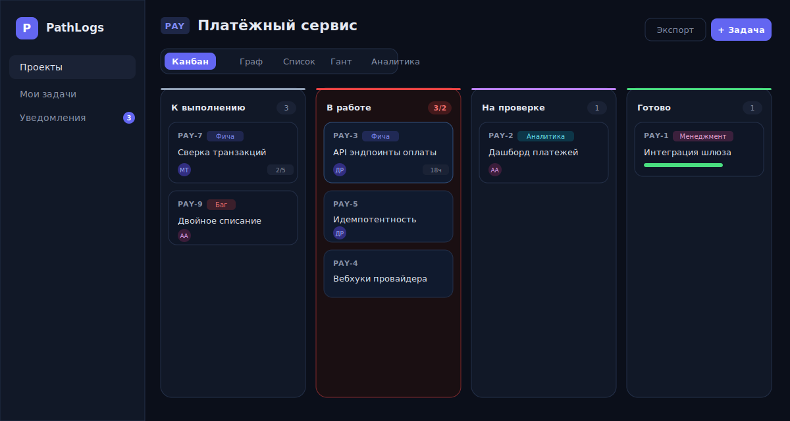
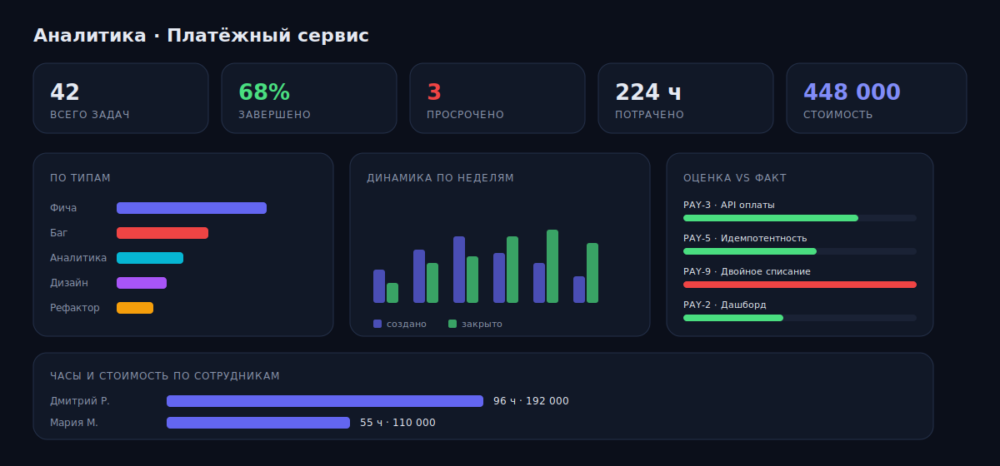

<div align="center">


<br/>

**Система управления проектами с ветвлением задач (как в git), канбан-доской (как в Trello) и патч-логами — полной историей реализации каждой задачи.**

<br/>

[](https://nextjs.org/)
[](https://www.typescriptlang.org/)
[](https://www.prisma.io/)
[](https://www.postgresql.org/)
[](https://authjs.dev/)
[](https://tailwindcss.com/)
[](#-тестирование)
[](LICENSE)

[Возможности](#-возможности) · [Быстрый старт](#-быстрый-старт) · [Интеграции](#-интеграции) · [Архитектура](#-архитектура) · [Дорожная карта](#-дорожная-карта)

</div>

---

## ✨ О проекте

**PathLogs** — это таск-трекер для команд разработки, бизнеса, менеджмента и аналитики. Он соединяет три идеи в одном инструменте:

- 🌳 **Ветвление задач как в git** — у любой задачи могут быть подзадачи-ветки любой глубины, а дерево рисуется на интерактивном графе.
- 📋 **Канбан как в Trello** — drag & drop, кастомные колонки, WIP-лимиты, перекраска карточек.
- 📝 **Патч-логи** — журнал реализации каждой задачи: что, как и кем было сделано, с трудозатратами и стоимостью.

Светлая и тёмная темы, ограниченный безопасный Markdown, экспорт в XLSX/PDF/ICS, интеграции со Slack, Telegram, Google Calendar и git — всё из коробки.

---

## 🖼 Скриншоты

<div align="center">

### Канбан-доска · WIP-лимиты · drag & drop


### Аналитика проекта · динамика · оценка vs факт · стоимость


</div>

---

## 🚀 Возможности

### Для разработчика
- **Граф веток** на React Flow с авто-раскладкой дерева: цвет ребра = статус, анимация = «в работе», пунктир = связи «блокирует / связана / дублирует».
- **Патч-логи** — журнал реализации с автором и временем.
- **Чек-листы** с прогресс-баром, инлайн-редактированием и начальным списком прямо в форме создания.
- **Git-интеграция**: упоминание `PAY-12` в сообщении коммита автоматически попадает в патч-лог задачи (через webhook).
- **«Мои задачи»** — все открытые задачи по всем проектам, сгруппированные по статусу, с подсветкой просроченных.
- **Горячие клавиши**: `g d` · `g m` · `g n` · `g p`, `?` — подсказка.

### Для менеджера
- **Канбан** с кастомными колонками и **WIP-лимитами** (превышение подсвечивается).
- **Диаграмма Ганта**: задачи-полосы на дневной шкале, перетаскивание и изменение сроков мышью.
- **Шаблоны задач** (например «Релиз») с готовым чек-листом — предзаполняют форму создания.
- **Несколько исполнителей**, приоритеты, типы, даты начала и срока, связи между задачами.
- **Права доступа**: владелец / менеджер / админ управляют составом, колонками и архивом.

### Для аналитика
- **Дашборд проекта**: распределение по статусам / типам / приоритетам.
- **Динамика по неделям** (создано vs закрыто), **оценка vs факт** по задачам.
- **Сохранённые фильтры** списка задач — применяются в один клик.

### Для бизнеса
- **Учёт ставок и стоимости** трудозатрат (часы × ставка) в аналитике и экспорте.
- **Экспорт**: проект в **XLSX** (задачи + трудозатраты) и печатный **PDF-отчёт**.
- **API-токены** и **исходящие webhooks** — Slack, Telegram, произвольный JSON.
- **Еженедельный отчёт на почту** (cron-эндпоинт + SMTP).

### Общее
- 🌗 **Светлая и тёмная темы** с сохранением выбора и без вспышки при загрузке.
- ✍️ **Ограниченный Markdown** в описаниях, патч-логах, комментариях и чек-листах — рендерится в React-элементы, без `dangerouslySetInnerHTML` (XSS исключён).
- 💬 **Комментарии** с **@упоминаниями** участников (персональные уведомления).
- 🔔 **Уведомления** (колокольчик): назначения, комментарии, упоминания, патч-логи, смена статуса.
- 📅 **Календарь**: задача → Google Calendar одной кнопкой или `.ics` (Outlook / Apple); выгрузка всего проекта одним `.ics`.
- 📎 **Файлы** к задачам: S3 / R2 / MinIO с автоматическим fallback на локальный диск.
- 🔐 **Авторизация**: email + пароль (bcrypt) и **Google OAuth**, JWT-сессии, роли.

---

## 🧱 Стек

| Слой | Технология |
|---|---|
| Фреймворк | Next.js 16 (App Router, FullStack, Server Actions, TypeScript) |
| База данных | PostgreSQL 16 + Prisma ORM 6 |
| Авторизация | Auth.js (NextAuth v5) — Credentials + Google OAuth, JWT, роли |
| Визуализация | React Flow (граф веток), собственная диаграмма Ганта |
| Стили | Tailwind CSS 4, светлая/тёмная темы |
| Экспорт | ExcelJS (XLSX), печатный PDF, iCalendar (ICS) |
| Почта | Nodemailer (SMTP) |
| Файлы | S3-совместимое хранилище с fallback на `./uploads` |
| Тесты | Vitest (права доступа и server actions) |

---

## ⚡ Быстрый старт

```bash
# 1. Поднять PostgreSQL (порт 5433, чтобы не конфликтовать с локальным)
docker compose up -d postgres

# 2. Установить зависимости и применить миграции
npm install
npx prisma migrate dev

# 3. (опционально) Демо-данные
node prisma/seed.mjs

# 4. Запустить
npm run dev
```

Откройте **http://localhost:3000**

### Демо-аккаунты

После `seed` (пароль у всех — `demo1234`):

| Аккаунт | Роль |
|---|---|
| `admin@pathlogs.dev` | Администратор |
| `manager@pathlogs.dev` | Менеджер |
| `analyst@pathlogs.dev` | Аналитик |
| `dev@pathlogs.dev` | Разработчик |

> Без seed первый зарегистрированный пользователь автоматически становится администратором.

---

## ⚙️ Конфигурация

Переменные окружения (`.env`):

| Переменная | Назначение |
|---|---|
| `DATABASE_URL` | Строка подключения PostgreSQL |
| `AUTH_SECRET` | Секрет Auth.js |
| `AUTH_TRUST_HOST` | `true` для прод-деплоя |
| `AUTH_GOOGLE_ID` / `AUTH_GOOGLE_SECRET` | Google OAuth (опционально) |
| `S3_ENDPOINT` / `S3_REGION` / `S3_BUCKET` / `S3_ACCESS_KEY_ID` / `S3_SECRET_ACCESS_KEY` / `S3_PUBLIC_URL` | Хранилище файлов (опционально) |
| `SMTP_HOST` / `SMTP_PORT` / `SMTP_USER` / `SMTP_PASS` / `SMTP_FROM` | Почта для отчётов (опционально) |

Все интеграции опциональны: без `S3_*` файлы сохраняются локально, без `SMTP_*` письма пишутся в консоль, без `AUTH_GOOGLE_*` скрывается кнопка входа через Google.

---

## 🔌 Интеграции

### Google OAuth
1. В [Google Cloud Console](https://console.cloud.google.com/apis/credentials) создайте OAuth Client ID (тип Web).
2. Redirect URI: `http://localhost:3000/api/auth/callback/google` (+ прод-адрес).
3. Пропишите `AUTH_GOOGLE_ID` и `AUTH_GOOGLE_SECRET` — кнопка «Войти через Google» появится сама.

### API-токены
Создайте токен в **Профиле → API-токены** и передавайте в заголовке `Authorization: Bearer <токен>`. В БД хранится только SHA-256-хэш; сам токен показывается один раз.

### Git-вебхук
`POST /api/git/webhook` (тело совместимо с push-хуком GitHub/GitLab):

```json
{ "commits": [{ "id": "<sha>", "message": "PAY-12 починил оплату", "url": "https://…" }] }
```

Каждое упоминание `КЛЮЧ-НОМЕР` превращается в запись патч-лога соответствующей задачи (с защитой от дублей по паре задача+sha).

### Slack / Telegram / generic webhooks
Подключаются на уровне проекта (**Интеграции**). События задач (назначения, комментарии, патч-логи, смена статуса) уходят в выбранные каналы.

### Еженедельный отчёт
`POST /api/cron/weekly-report` (токен администратора) — ставится на cron. Рассылает участникам сводку по проекту; `?projectId=…` — отчёт по одному проекту.

---

## 🏛 Архитектура

```
prisma/schema.prisma            — модели: User, Project, Task (self-relation = ветки),
                                  BoardColumn (+WIP), TaskLink, PatchLog, TimeEntry,
                                  Attachment, ChecklistItem, Comment, Notification,
                                  TaskTemplate, SavedFilter, ApiToken, WebhookEndpoint,
                                  GitCommitRef
src/auth.ts                     — Auth.js: Credentials + Google OAuth, JWT, роли
src/proxy.ts                    — защита маршрутов (middleware)
src/lib/access.ts               — проверки доступа: членство в проекте, роли
src/lib/actions/                — server actions (auth, projects, tasks, board, admin,
                                  templates, filters, tokens, webhooks)
src/lib/{notify,webhooks}.ts    — уведомления и доставка в Slack/Telegram
src/lib/{report,email}.ts       — недельный отчёт и отправка по SMTP
src/lib/{calendar,tokens}.ts    — ICS-календарь и API-токены
src/lib/storage.ts              — S3 + локальный fallback
src/app/(auth)/                 — вход / регистрация (анимированный сплит-экран)
src/app/(app)/dashboard         — проекты
src/app/(app)/projects/[id]     — канбан / граф / список / Гант / аналитика
src/app/(app)/tasks/[id]        — задача: патч-лог, комментарии, время, файлы, чек-лист
src/app/(app)/{my,notifications,profile,admin}
src/app/(print)/…/report        — печатный PDF-отчёт
src/components/                 — KanbanBoard, TaskGraph, GanttChart, ProjectStats,
                                  Markdown, AppShell, ThemeToggle, диалоги …
```

---

## 🧪 Тестирование

Тесты прав доступа и server actions используют отдельную БД `pathlogs_test` в том же Postgres:

```bash
npm test
```

```
 Test Files  2 passed (2)
      Tests  59 passed (59)
```

---

## 🗺 Дорожная карта

- [ ] Вложенные ответы (threads) в комментариях
- [ ] Зависимости задач стрелками прямо на диаграмме Ганта
- [ ] Фильтры Ганта по исполнителю и статусу
- [ ] Real-time обновления доски (WebSocket / SSE)
- [ ] Мобильное приложение / PWA
- [ ] Экспорт диаграмм в PNG

---

## 🤝 Вклад

PR и issue приветствуются. Перед PR:

```bash
npm run lint     # ESLint
npx tsc --noEmit # проверка типов
npm test         # тесты
```

---

## 📄 Лицензия

[MIT](LICENSE) © PathLogs

<div align="center"><sub>Сделано с ❤️ для команд, которые любят порядок в задачах.</sub></div>
